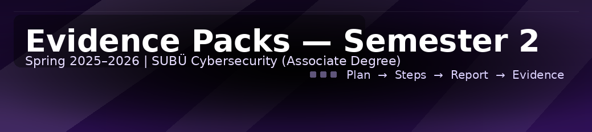

  

# Evidence Packs — Semester 2 (Spring 2025–2026)

## Courses
- [01 — Siber Saldırı ve Savunma Yöntemleri (BGT205)](01_Siber_Saldiri_ve_Savunma_Yontemleri)
- [02 — Güvenlik Duvarı Çözümleri Uygulama ve Yönetimi (BGT206)](02_Guvenlik_Duvari_Cozumleri_Uygulama_ve_Yonetimi)
- [03 — Ağ Sistemleri ve Yönlendirme (BGT207)](03_Ag_Sistemleri_ve_Yonlendirme)
- [04 — Python Programlama (BGT212)](04_Python_Programlama)
- [05 — Programlama II (DDO206)](05_Programlama_II)
- [06 — Veritabanı Yönetim Sistemleri (DDO208)](06_Veritabani_Yonetim_Sistemleri)
- [07 — Bilişimde Yeni Teknolojiler (ESD205)](07_Bilisimde_Yeni_Teknolojiler)

## Semester Capstone
- [99 — Semester Capstone](99_Semester_Capstone)
